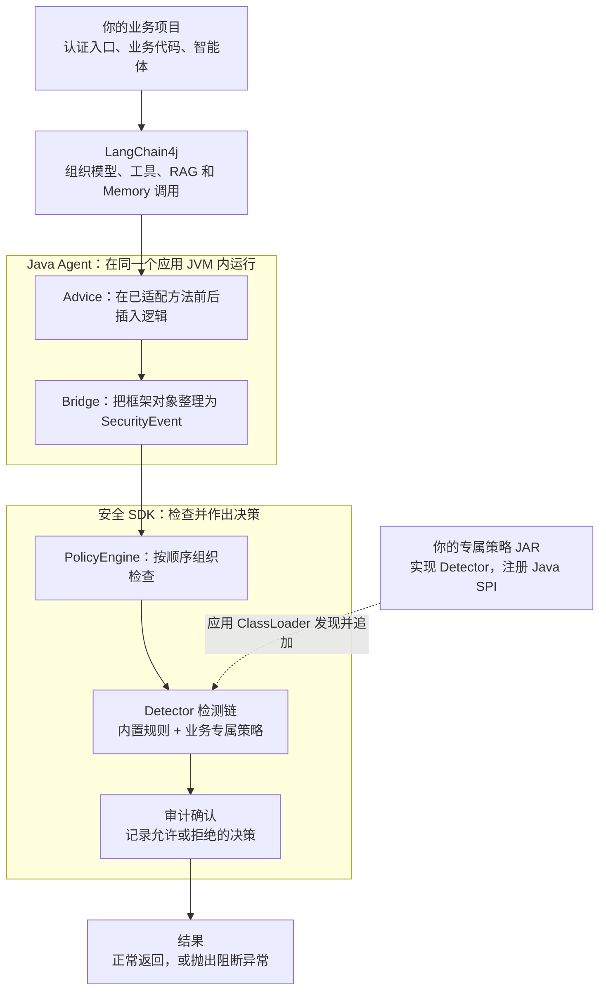
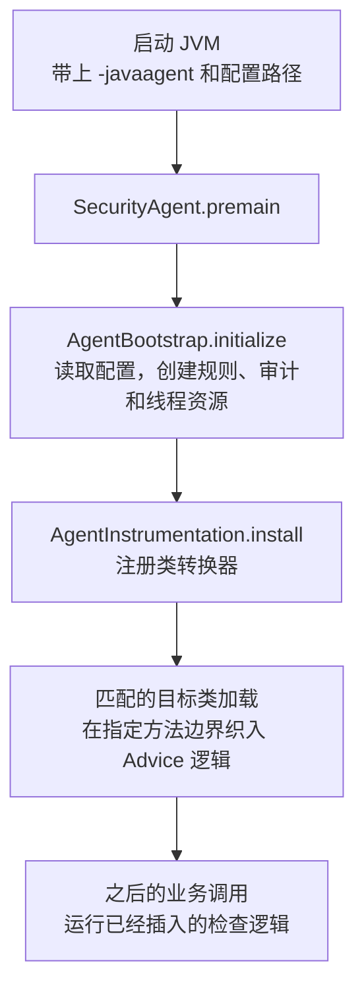
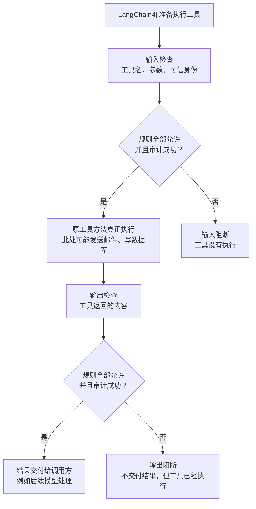
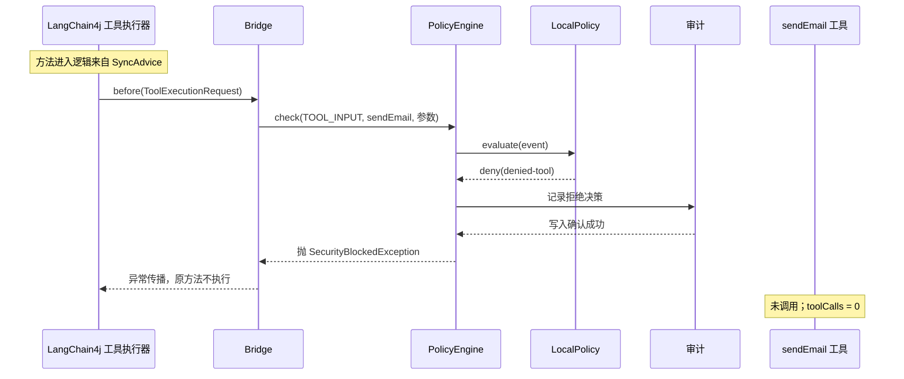
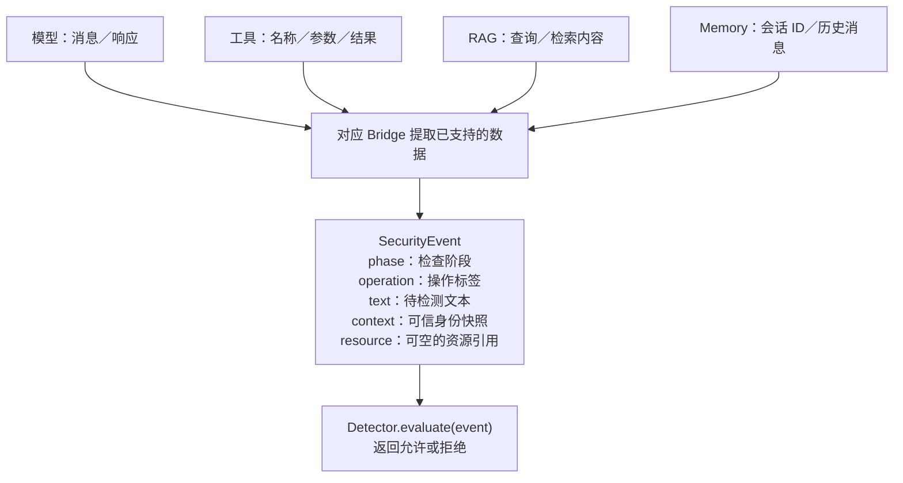
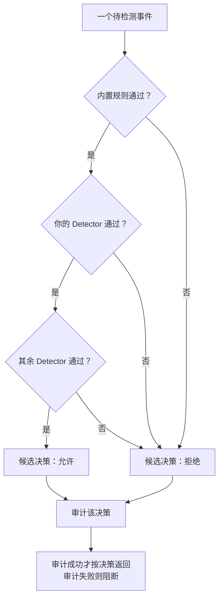
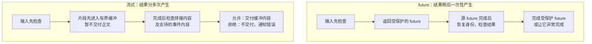

# 图解架构：先看懂一次调用，再看源码

先把它想成放在框架入口的**安全检查站**：业务要让 LangChain4j 调用模型、执行工具、检索资料或读写记忆时，Agent 在已经适配的方法边界插入检查；SDK 负责决定能否继续。

**第一遍只记三个角色：Agent 找到检查位置，Bridge 整理待检查的信息，PolicyEngine 组织规则并决定放行。** 本文的图是简化后的职责与调用关系，不代表每个图框都是独立进程，也不展示所有重入和嵌套调用。

## 图 1：整体架构——谁负责什么



图中连线表示“进入安全检查”的主链路，具体什么时候执行原方法见图 3。没有默认独立安全服务器：Agent 和 SDK 都在应用 JVM 内；你可以在 Detector 里自行调用远程检测服务。

| 图中的角色 | 源码对应 | 可以先这样理解 |
| --- | --- | --- |
| 你的应用 | `demo/Demo.java` 中的 `main` 和工具方法 | 想完成业务任务的人 |
| 插入检查的位置 | `instrumentation/advice/*Advice.java` | 安检站的入口与出口 |
| 整理信息 | `bridge/Bridge.java`，以及 RagBridge、MemoryBridge | 把不同调用整理成统一检查单 |
| 组织检查 | `core/PolicyEngine.java` | 按顺序把检查单交给规则，并处理结果 |
| 判断业务是否合规 | `core/Detector.java` 的实现 | 每一条检查规则 |
| 审计 | `BoundedAuditSink`、`FileAuditSink` | 确认决策记录已经写入；失败也不放行 |

`agent-security-core` 是独立 SDK；`agent-security-javaagent` 是自动接入层；`agent-security-policy` 提供结构化参数策略。`integration-spring-boot` 只是集成测试应用，普通 Java 项目不需要依赖 Spring。

## 图 2：启动一次，与每次调用，是两回事



可以把启动阶段理解为“把检查站安装好”，运行阶段理解为“每次经过检查站接受检查”。因此，**每次请求不用重新执行 `premain`**。

为什么业务源码不用写 `engine.check(...)`？因为 JVM 加载符合条件的框架类型时，Agent 修改了这些方法实际执行的字节码。Java 源码里的方法调用看起来没变，运行时多了前后检查。

这里不是拦截 JVM 中所有行为，也不是扫描到 `@Tool` 注解就保护任何直接调用。当前主要在已适配的 LangChain4j 模型、工具执行器等方法边界插入检查；绕开这些边界的直接业务方法／数据库访问仍可能不受控。

## 图 3：一条正常工具调用，先检查，再执行，再检查结果



把两道检查分清，很多代码就容易理解了：

- **输入检查**用于阻止不该发生的动作，例如没有退款权限时，不让退款工具执行。
- **输出检查**用于阻止不该传播的内容，例如读取工具返回了秘密，不让结果继续交付。
- 输出检查不能撤销已经发送的邮件、退款或数据库写入。授权应放在执行前。

每个检查框内部都包含“规则链 + 审计确认”。不是只有允许才记录审计，也不是只记录日志而不阻断。

## 图 4：真实例子——为什么 sendEmail 根本没有执行

仓库 `config/demo.properties` 包含 `deny.tools=sendEmail,deleteAll`。下面只画这次工具调用的输入检查，省略此前模型请求与其检查。



你可以先完全不读 Byte Buddy，只看这四个位置：

1. `SyncAdvice.enter`：发现它调用 `Bridge.before`。
2. `Bridge.before`：发现它把工具名和参数转成 `SecurityEvent`。
3. `PolicyEngine.check`：发现它调用 Detector，审计后在拒绝时抛异常。
4. `LocalPolicy.evaluate`：发现工具在拒绝列表里时返回 `denied-tool`。

再回头看业务 `CustomerTools.sendEmail()`：代码没有安全检查，但计数没有增加，因为框架执行入口已经被阻断。Advice 通常内联进目标字节码，实际调试优先在 Bridge 和 PolicyEngine 下断点。

## 图 5：SecurityEvent 是什么——一张统一的检查单



例如退款工具的检查单可以读成：“现在是工具执行前，工具叫 `refundOrder`，参数文本是这些，认证用户拥有这些权限。”

`context` 必须由业务认证入口建立，不能相信模型在参数里说“我是管理员”。`resource` 只是请求访问的对象，当前主要用于 Memory；资源 ID 不证明这个资源归该用户所有。事件不是整个框架对象的完整复制，各阶段字段语义见 [扩展指南](sdk-extension.md)。

## 图 6：你写的专属策略放在哪里



这不是投票。任何一个检测器拒绝，后面的规则就可能不再执行；你的 `allow()` 不能覆盖内置拒绝。图中专属策略的位置表示“追加到内置策略之后”，不保证不同插件 JAR 之间的发现顺序。

检测异常、超时、返回 null 等按失败拒绝处理。自定义 Detector 在线程数和队列有上限的线程池中执行；超时请求中断，不会无限创建新线程。不要在 Detector 里真正发送邮件、扣款或扣减额度，因为检测可能重复执行，也可能被前面的拒绝短路。

## 图 7：异步与流式为什么多出这么多类

它们主要是在解决“结果还没产生，或者只产生了一部分”的问题，安全原则仍然是检查后才交付。



| 你在代码里看见的类 | 它解决的问题 |
| --- | --- |
| `FutureAdvice`、`Bridge.guardFuture` | 原结果晚到，不能提前认为安全；要检查后完成包装 future |
| `SecurityContexts`、`ContextPublisher` | 换了线程，仍使用原请求身份，结束后恢复线程原状态 |
| `GuardedStream` | 回调流先缓存，最终检查后回放 |
| `GuardedPublisher` | Flow 流还要尊重下游 `request(n)`，并处理取消和单次终止 |
| `StreamLimits`、`StreamRuntime` | 缓冲大小、活跃流数量、超时和资源释放 |

这解释了全量缓冲为何会推迟首字交付。异常、取消、超时可以中途终止，不必等正常生成完；不能从图中推断所有 provider 或异步业务线程都已覆盖。

## 用两个计数来读懂结果

现在再运行最简单的三条命令。若还没有构建产物，先按 [源码学习指南第 1 步](source-learning.md) 构建。

```bash
java -jar demo/target/agent-security-demo.jar tool
bash scripts/demo.sh tool
bash scripts/demo.sh tool-output
```

| 场景 | toolCalls | 该如何理解 |
| --- | --- | --- |
| 无 Agent，执行 tool | 1 | 邮件模拟工具正常执行，没有这一层拦截 |
| 启用 Agent，执行 tool | 0 | sendEmail 在工具执行前被拒绝 |
| 启用 Agent，执行 tool-output | 1 | readCustomer 已执行，但敏感结果被拒绝交付 |

`modelCalls` 统计模型实际执行次数；不要把它与策略检查次数混为一谈。同一框架调用经过多层保护时可能产生多个事件。

## 看图以后，只读这五小段源码

不用按文件从头读到尾。先在 IDE 搜索类和方法，每次只回答一个问题。

| 顺序 | 打开的位置 | 只回答这个问题 |
| --- | --- | --- |
| 1 | `Demo.CustomerTools.sendEmail` | 如果真的执行，哪个计数会增加？ |
| 2 | `LocalPolicy.evaluate` | 哪行规则使 sendEmail 被拒绝？ |
| 3 | `PolicyEngine.check` | 拒绝结果如何变成真正的异常？审计在哪一步？ |
| 4 | `Bridge.before` | 工具名和参数从哪来，怎样变成事件？ |
| 5 | `SyncAdvice.enter` | 为什么进入框架方法会调用 Bridge？ |

这五段连起来后，再读 `AgentInstrumentation.install`，理解“检查逻辑是怎么装进去的”。更完整的逐步阅读、断点和练习见 [源码学习指南](source-learning.md)；要写自己的策略，则转到 [SDK 扩展指南](sdk-extension.md)。

当前适配范围固定为 LangChain4j 1.20.0。图表示当前设计原理，不扩大已验证的覆盖范围；真实边界见 [生产验收清单](production-readiness.md)。
