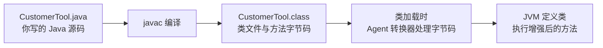
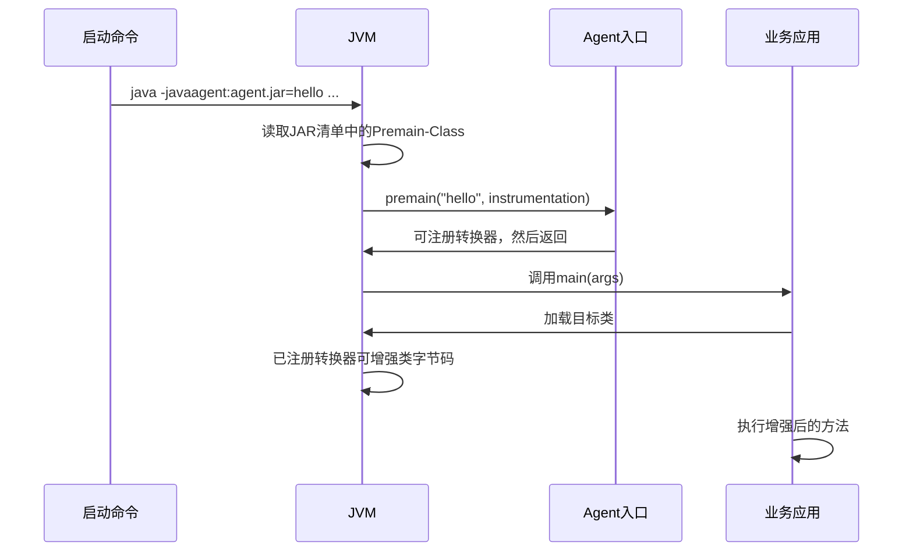
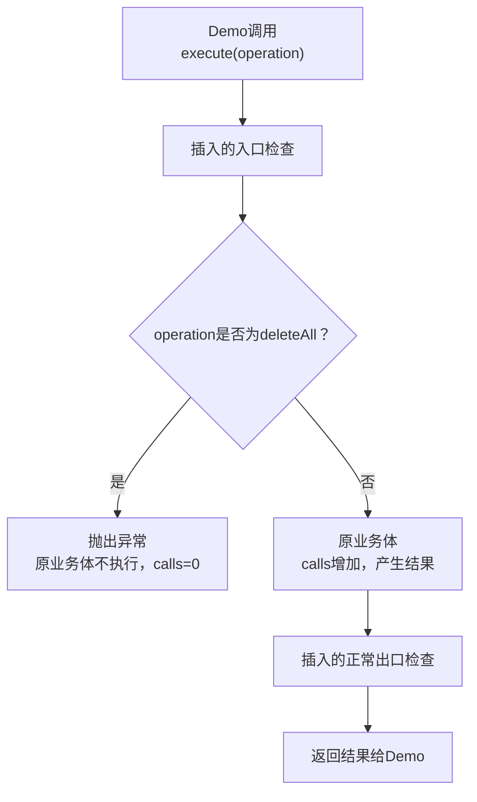
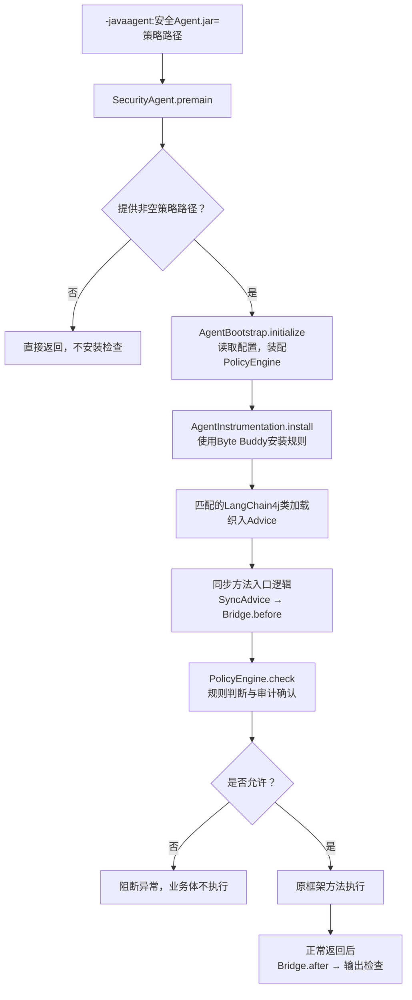

# Byte Buddy 与 Java Agent：从零看懂方法拦截

这份文档面向还没学过字节码增强的读者。学习目标是自己回答：**业务代码没有调用安全 SDK，为什么方法执行前仍然会出现安全检查？**

推荐顺序：先读第 1～4 节，再运行两个实验，最后对照当前仓库。第一遍不用学习 JVM 指令集、ASM 或复杂类加载器。需要能阅读 Java 方法、注解、异常，并能在终端运行 Java；完整示例需要 JDK 17 或以上。

## 1. 先分清三个名字

| 名字 | 它是什么 | 在当前仓库做什么 |
| --- | --- | --- |
| Java Agent | JVM 提供的程序增强接入机制；通常打包成一个带特殊清单的 JAR | 通过启动入口安装检查逻辑 |
| `-javaagent` | Java 启动命令中的 JVM 参数 | 告诉 JVM 加载哪个 Agent JAR、传什么配置字符串 |
| Byte Buddy | 生成、修改 Java 类字节码的库 | 帮 Agent 匹配目标方法、织入检查，免去手写字节码 |

另外，项目中的父 Agent／子 Agent 是业务上的 AI 智能体，和这里的 Java Agent 不是同一个概念。Java Agent 是安装在 JVM 中的程序组件，不是语言模型。

**Java Agent 可以不用 Byte Buddy；Byte Buddy 也可以用于生成类而不启动 Java Agent。**本项目把两者组合使用。Byte Buddy 的能力和示例见 [官方项目说明](https://github.com/raphw/byte-buddy)。

## 2. 字节码是什么，为什么源码没改却能多执行逻辑

Java 源码先由编译器生成 `.class` 文件，再由 JVM 加载和执行。字节码是 `.class` 中描述方法等内容的表示方式，不是机器代码，也不是你的 `.java` 源文件。



有 Agent 时，转换器可以在类定义前处理字节码。原来的文件不一定改变；本项目是在加载过程中增强方法，没有把业务源码改写到磁盘。Byte Buddy 提供 Java API 来描述这些变更。

比如业务源码是：

```java
public String execute(String operation) {
    return doBusiness(operation);
}
```

加入检查后的**执行效果**可以这样理解：

```java
public String execute(String operation) {
    checkBefore(operation);
    String result = doBusiness(operation);
    checkAfter(result);
    return result;
}
```

第二段只是理解用的伪代码，不表示 Byte Buddy 生成了一份新的 `.java` 文件。执行前检查抛出异常，原业务体就不会执行；执行后检查拒绝，只能拒绝交付结果，不能撤销已经发生的业务副作用。

## 3. `-javaagent` 参数到底怎么写

Oracle 定义的启动语法是 `-javaagent:<jarpath>[=<options>]`：JAR 路径用于加载 Agent，等号后是传给 Agent 的一个字符串，由 Agent 自己解释。[Java 17 官方规范](https://docs.oracle.com/en/java/javase/17/docs/api/java.instrument/java/lang/instrument/package-summary.html)

本仓库的实际接入例子：

```bash
java -javaagent:/opt/security/agent-security-javaagent.jar=/opt/security/policy.properties \
  -jar /opt/app/business.jar
```

逐段拆开：

| 部分 | 谁处理 | 含义 |
| --- | --- | --- |
| `java` | Java 启动器 | 启动 JVM |
| `-javaagent:/opt/security/agent-security-javaagent.jar` | JVM 的 Agent 机制 | 加载安全 Agent JAR |
| `=/opt/security/policy.properties` | 传给本项目的 `premain` | 本项目把它解释为策略文件路径 |
| `-jar /opt/app/business.jar` | Java 启动器 | 启动业务应用 |

`policy.properties` 的含义是本项目定义的，不是 JVM 内置规则。其他 Agent 可以接收 `hello` 或 `mode=debug` 等字符串，并自行解析。

注意启动参数的位置与区别：

```bash
# 正确：JVM 参数放在 -jar 前面。
java -javaagent:/path/security.jar=/path/policy.properties -jar app.jar

# 错误接入：-jar 后面的内容传给业务 main，不会加载 Agent。
java -jar app.jar -javaagent:/path/security.jar=/path/policy.properties

# 整个参数有空格时，用引号保持它是一个命令行参数。
java "-javaagent:/path with spaces/security.jar=/path with spaces/policy.properties" -jar app.jar
```

`-Dkey=value` 用来设置 JVM 系统属性，不等于 `-javaagent`。仅把 Agent JAR 写入 Maven 依赖也不会自动调用 `premain`。普通 Java 应用和 Spring Boot 可执行 JAR 均可以使用启动参数；基础接入不依赖 Spring。

最新源码里，只指定 `-javaagent:/path/security.jar` 而不提供策略路径，`SecurityAgent.premain` 会直接返回，不安装安全检查。**这是本 SDK 的选择，不是所有 Java Agent 的通用行为。**传入存在的空策略文件仍会启用检查；旧 release 的行为需查 [使用手册](sdk-user-guide.md)。

## 4. JVM 怎样找到 Agent 的入口

Agent JAR 的 `META-INF/MANIFEST.MF` 包含入口声明，例如：

```text
Manifest-Version: 1.0
Premain-Class: training.PrintAgent
```

`Premain-Class` 是类的完整名称，不是 Java 文件路径。入口通常写成：

```java
public static void premain(String agentArgs, Instrumentation instrumentation) {
    // agentArgs：等号后的配置字符串。
    // instrumentation：JVM 传入的增强能力接口。
}
```

`Instrumentation` 是 JDK 接口，提供注册类转换器等能力；它不是策略引擎。Byte Buddy 的 `installOn(instrumentation)` 使用这些能力安装转换器。



重点是 `premain` 先于应用 `main`，它安装逻辑后返回，不是每次业务请求都执行。Agent 启动失败或 `premain` 抛出未捕获异常，会导致 JVM 启动中止；不要把它和运行期间某一次检查拒绝混为一谈。

有些工具支持进程运行后动态加载，通过 `agentmain` 接入。本仓库当前提供启动时的 `premain` 接入，不提供动态 attach 方案。`Can-Redefine-Classes`、`Can-Retransform-Classes` 控制已经加载的类的相关能力；本项目均声明为 `false`，这不妨碍对之后加载的匹配类进行转换。

## 5. 实验一：不用 Byte Buddy，先观察启动顺序

仓库提供独立教学源码，位于 `examples/bytebuddy-basics/src/training`，从 [PrintAgent.java](https://github.com/umuo/langchain4j-runtime-security/blob/main/examples/bytebuddy-basics/src/training/PrintAgent.java) 开始阅读；示例不加入 SDK 发布模块。先在仓库根目录构建一次 Agent，下载项目固定版本 Byte Buddy；已有本地构建可跳过：

```bash
mvn -B -ntp -s .mvn/settings.xml -Dmaven.repo.local=.cache/m2 \
  -pl agent-security-javaagent -am -DskipTests package
```

教学程序的业务类 `CustomerTool` 完全不使用 SDK：

```java
public String execute(String operation) {
    calls++;
    System.out.println("[business] execute=" + operation);
    return "done:" + operation;
}
```

`Demo.main` 调用它，并打印 `calls`。计数只在业务方法真正进入时增加，适合观察拒绝是否发生在执行前。

第一个 Agent 的全部逻辑就是打印：

```java
public static void premain(String agentArgs, Instrumentation instrumentation) {
    System.out.println("[premain] options=" + agentArgs);
}
```

运行：

```bash
bash scripts/demo_bytebuddy.sh startup
```

预期输出顺序：

```text
[premain] options=hello
[main] started
[business] execute=readCustomer
[main] result=done:readCustomer
[main] calls=1
```

你应该能解释：`hello` 来自启动参数，`premain` 在 `main` 之前，业务没有被阻断。这个 `PrintAgent` 没有使用 Byte Buddy，没有注册转换器，所以不会改变业务方法。

脚本需要 Bash、JDK 17+，适用于 macOS／Linux；可通过 `JAVA_HOME` 指定 JDK。编译和教学 JAR 写入 `target/bytebuddy-basics`，不调用模型、不创建审计文件。

## 6. 实验二：使用 Byte Buddy 加入方法检查

### 6.1 用匹配器选择类和方法

[GuardAgent.java](https://github.com/umuo/langchain4j-runtime-security/blob/main/examples/bytebuddy-basics/src/training/GuardAgent.java) 中的核心代码：

```java
new AgentBuilder.Default()
        .disableClassFormatChanges()
        .type(named("training.CustomerTool"))
        .transform((builder, type, loader, module, domain) ->
                builder.visit(
                        Advice.to(GuardAdvice.class)
                                .on(named("execute").and(takesArguments(String.class)))))
        .installOn(instrumentation);
```

| 代码 | 用日常语言理解 |
| --- | --- |
| `new AgentBuilder.Default()` | 开始描述类转换规则 |
| `disableClassFormatChanges()` | 禁止改变类结构的转换模式；这里保留方法签名，加入检查 |
| `type(named(...))` | 只选择指定名称的类 |
| `transform(...)` | 告诉 Byte Buddy 如何修改匹配到的类 |
| `Advice.to(GuardAdvice.class)` | 使用这个类中声明的入口／出口逻辑 |
| `on(named(...).and(takesArguments(...)))` | 方法名及参数签名都匹配才增强 |
| `installOn(instrumentation)` | 把转换器注册给 JVM |

这一步是在安装规则。之后目标类加载时，才按照规则处理字节码。`named` 是精确名称匹配，`and` 表示同时满足；本项目还使用 `hasSuperType` 来识别框架接口的实现。

### 6.2 Advice 怎样获得业务参数和结果

[GuardAdvice.java](https://github.com/umuo/langchain4j-runtime-security/blob/main/examples/bytebuddy-basics/src/training/GuardAdvice.java)：

```java
@Advice.OnMethodEnter
public static void enter(@Advice.Argument(0) String operation) {
    System.out.println("[advice] before=" + operation);
    if ("deleteAll".equals(operation)) {
        throw new IllegalStateException("demo-deny-tool");
    }
}

@Advice.OnMethodExit
public static void exit(@Advice.Return String result) {
    System.out.println("[advice] after=" + result);
}
```

`@Advice.Argument(0)` 指原方法的第一个参数，不是 `main` 的第一个启动参数。`@Advice.Return` 取得原方法的返回值。这里默认的 `OnMethodExit` 在正常返回时执行，没有配置异常退出也执行；入口抛出拒绝异常时，不会继续执行业务体或这段正常出口逻辑。

Advice 默认把代码内联进目标方法，可以理解为复制对应字节码进去，而不是每次都通过代理对象调用 Advice 类。因此 IDE 中 Advice 源码断点可能不命中；当前仓库推荐在 `Bridge.before`、`PolicyEngine.check` 等实际被调用的方法下断点。

### 6.3 运行允许与拒绝对照

```bash
# 无 Agent：危险操作也执行，业务 calls=1。
bash scripts/demo_bytebuddy.sh baseline

# 启用 GuardAgent：普通操作允许，前后检查都出现。
bash scripts/demo_bytebuddy.sh allow

# 启用 GuardAgent：deleteAll 在业务方法执行前被拒绝。
bash scripts/demo_bytebuddy.sh deny
```

允许场景的关键顺序：

```text
[premain] guard installed
[main] started
[advice] before=readCustomer
[business] execute=readCustomer
[advice] after=done:readCustomer
[main] result=done:readCustomer
[main] calls=1
```

拒绝场景：

```text
[premain] guard installed
[main] started
[advice] before=deleteAll
[main] blocked=demo-deny-tool
[main] calls=0
```



观察到 `calls=0` 比只看到“安装成功”更能证明执行前拒绝。教学代码捕获异常以便展示结果；真实项目需要按照业务接口设计拒绝处理。

### 6.4 JAR 和 classpath 怎么组织

脚本用 `javac --release 17` 编译，用 `jar --manifest` 添加入口清单。生成两个教学 Agent JAR，然后执行类似命令：

```bash
java -javaagent:target/bytebuddy-basics/guard-agent.jar \
  -cp "target/bytebuddy-basics/classes:.cache/m2/net/bytebuddy/byte-buddy/1.18.14/byte-buddy-1.18.14.jar" \
  training.Demo deleteAll
```

这里版本对应当前根 POM；脚本自动读取版本，升级后不必手改脚本。为了简化教学，Byte Buddy 在应用 classpath 中提供给 Agent，教学 JAR 也不会隐藏所有辅助类。**实际安全 Agent 的打包方式不同：Maven Shade 将所需依赖打入 Agent JAR，运行时不要求业务额外提供 Byte Buddy。**

以上是教学代码，没有生产版本检查、审计、检测超时、转换失败持续拒绝和 ClassLoader 兼容治理，不能代替当前 SDK。

## 7. 对应到当前仓库的源码



| 学习顺序 | 实际文件 | 只回答这个问题 |
| --- | --- | --- |
| 1 | [SecurityAgent](https://github.com/umuo/langchain4j-runtime-security/blob/main/agent-security-javaagent/src/main/java/io/agentsecurity/agent/SecurityAgent.java) | JVM 从哪里进入？无配置为何返回？ |
| 2 | [AgentBootstrap](https://github.com/umuo/langchain4j-runtime-security/blob/main/agent-security-javaagent/src/main/java/io/agentsecurity/agent/AgentBootstrap.java) | 检查需要的规则和资源如何装配？ |
| 3 | [AgentInstrumentation](https://github.com/umuo/langchain4j-runtime-security/blob/main/agent-security-javaagent/src/main/java/io/agentsecurity/agent/instrumentation/AgentInstrumentation.java) | 匹配哪个框架类型、哪种方法？ |
| 4 | [SyncAdvice](https://github.com/umuo/langchain4j-runtime-security/blob/main/agent-security-javaagent/src/main/java/io/agentsecurity/agent/instrumentation/advice/SyncAdvice.java) | 参数如何交给 Bridge？返回值如何检查？ |
| 5 | [Bridge](https://github.com/umuo/langchain4j-runtime-security/blob/main/agent-security-javaagent/src/main/java/io/agentsecurity/agent/bridge/Bridge.java) | 怎样把框架对象整理为 SecurityEvent？ |
| 6 | [PolicyEngine](https://github.com/umuo/langchain4j-runtime-security/blob/main/agent-security-core/src/main/java/io/agentsecurity/core/PolicyEngine.java) | 拒绝怎样变成阻断异常？ |

先在 `AgentInstrumentation` 中搜索 `Advice.to(SyncAdvice.class)`，不要从头阅读所有适配分支。本项目还有异步、流式、RAG、Memory、MCP Advice，原理相关但状态处理更复杂，同步链路读懂以后再学。

教学例子直接增强 `CustomerTool.execute`；本仓库主要增强 LangChain4j 的模型、工具执行器等已适配边界，并非扫描所有 `@Tool` 业务方法后增强。绕开框架直接调用一个业务方法，并不自动受到 SDK 的保护。

## 8. 常见疑问与排查

| 现象或疑问 | 理解和检查方式 |
| --- | --- |
| 为什么不是普通动态代理？ | 本例修改目标类的方法字节码，不要求业务持有某个代理对象；仍然必须命中类型和方法匹配。 |
| 为什么只有部分方法有检查？ | 匹配器限定了目标，并非 JVM 全部操作。当前 SDK 也只支持明确适配的边界。 |
| 加了 Agent 但没拦截 | 检查参数是否位于 `-jar` 前；本 SDK 是否提供策略路径；目标签名和版本是否支持；是否绕过了框架入口。 |
| `Failed to find Premain-Class` | JAR 清单没有正确声明启动入口，或启动参数指向了错误 JAR。 |
| 缺少 Byte Buddy 类 | 教学程序检查 `-cp` 和依赖文件；生产接入使用正确打包的 Agent JAR。 |
| 安装日志成功就代表受保护？ | 不代表。用业务调用计数验证具体允许／拒绝路径，并关注转换失败。 |
| Advice断点不命中 | 默认内联会影响调试映射，优先对实际被调用的 Bridge／引擎下断点。 |
| Agent能撤销发出的邮件吗？ | 不能。输出拒绝不能回滚业务副作用，权限检查需要在执行前。 |

## 9. 做三个小练习检验理解

1. 修改 `PrintAgent` 的 `hello` 参数，解释它怎样传到 `agentArgs`，为什么不进入业务 `args`。
2. 把教学 Advice 的禁止值改为 `readCustomer`，重新运行允许／拒绝场景；每次脚本会重新编译，观察 `calls`。
3. 把教学匹配的方法名改成一个不存在的名字，观察 `deleteAll` 为什么重新执行。完成后恢复示例源码，不把错误匹配提交上线。

能解释这三个结果，就可以继续 [源码学习指南](source-learning.md) 第 4 步。无需先掌握 Byte Buddy 全部功能。

## 10. 资料与本次验证范围

- [Oracle Java Instrumentation 规范](https://docs.oracle.com/en/java/javase/17/docs/api/java.instrument/java/lang/instrument/package-summary.html)：启动参数、入口和清单。
- [Byte Buddy 官方项目](https://github.com/raphw/byte-buddy)：生成类和 Java Agent 示例。
- [Byte Buddy Advice 源码与说明](https://github.com/raphw/byte-buddy/blob/master/byte-buddy-dep/src/main/java/net/bytebuddy/asm/Advice.java)：内联及注解行为；外部主分支会变化，实际 API 以项目固定依赖为准。

本文描述当前源码和教学实验，不扩大 SDK 的版本或操作覆盖承诺。文档与教学示例的验证不能代替完整 SDK 发布矩阵；生产支持边界见 [生产验收清单](production-readiness.md)。

2026-10-07，本机 macOS arm64 / Azul JDK 21.0.4 实际运行四种场景：baseline 的业务计数为 1；startup 确认 premain 先于 main；allow 的前后检查顺序正确且计数为 1；deny 的计数为 0、没有正常出口输出。根项目格式／规范校验、脚本语法检查和 Wiki 严格构建通过。本轮未更改 SDK 运行时代码，没有重跑完整发布矩阵。
