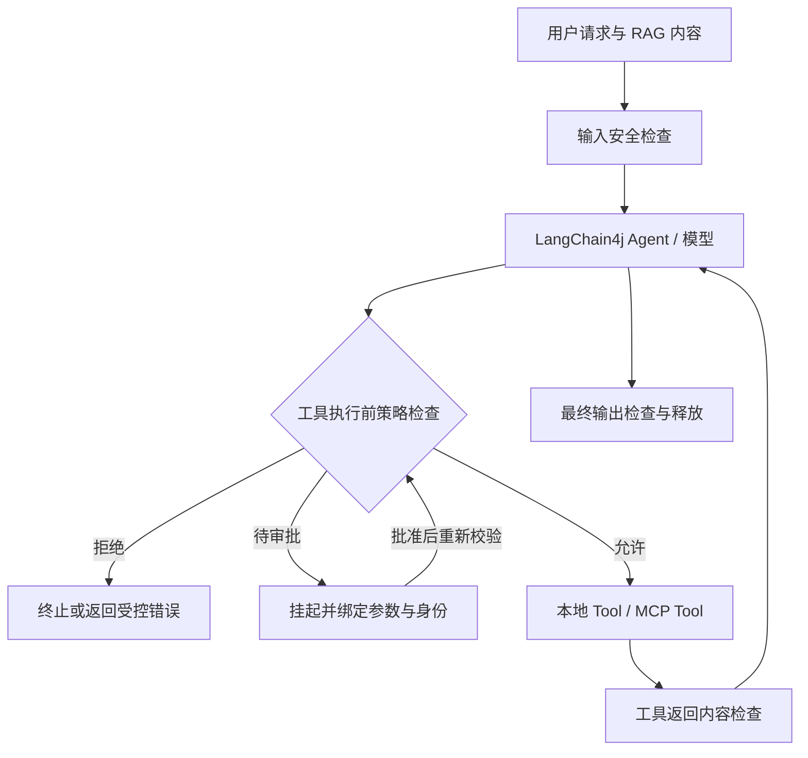

# LangChain4j Agent 运行时安全：开源方案 Spike

调研日期：2026-09-26。用户优先级：运行时检测／拦截。

本次是文档与公开仓库调研，不是已完成的运行验证。当前工作目录为空，没有业务 Agent、LangChain4j 版本或模型配置；未安装候选项目、未执行攻击测试，也未测量延迟。以下明确区分项目已有能力、建议接法和待验证项。

## 结论

有可复用的开源组件，但本次没有确认一个能够零改造覆盖 LangChain4j 输入、RAG、模型、全部本地工具、MCP 和流式输出的成熟一体化产品。

建议优先验证：**LangChain4j 原生扩展点 + 工具执行前策略检查 + 可替换的内容检测服务**。如果主要使用 MCP，则增加 Invariant Gateway 对照组。先解决危险动作执行前的阻断，再比较提示注入分类器效果。

这是一项架构建议：文本分类负责识别可疑内容，可信身份、工具权限、参数约束和出口控制负责限制实际动作。分类器通过不代表工具获得授权。

## 运行时候选

| 项目 | 已核实能力／许可 | LangChain4j 接法 | 选型判断与限制 |
| --- | --- | --- | --- |
| [LangChain4j Guardrails](https://docs.langchain4j.dev/tutorials/guardrails/) | 原生输入／输出校验；仓库 Apache-2.0 | AI Services 注册 InputGuardrail / OutputGuardrail | 首选接入基础；工具执行授权需要另外实现；Guardrails 仍标为实验性 |
| [NeMo Guardrails](https://github.com/NVIDIA-NeMo/Guardrails) | 输入、输出、检索和执行 rails；Python API / server；Apache-2.0 | 建议作为独立服务由 Java 同步调用 | 内容与策略编排候选；其 execution rails 不会自动接管 JVM 中的本地工具，必须显式接线 |
| [LlamaFirewall](https://github.com/meta-llama/PurpleLlama/tree/main/LlamaFirewall) | PromptGuard、AlignmentCheck、CodeShield 等扫描器；框架 MIT | 建议包装 Python HTTP 服务，在输入和工具返回边界调用 | 适合注入和 Agent 轨迹检测；模型另有许可、下载和推理依赖；AlignmentCheck 需要可用轨迹，不应假定所有模型开放内部推理 |
| [Invariant Guardrails](https://github.com/invariantlabs-ai/invariant) + [Gateway](https://github.com/invariantlabs-ai/invariant-gateway) | 规则匹配消息、工具调用及调用间的数据流；LLM / MCP 代理；两仓库 Apache-2.0 | 建议代理 MCP 或兼容的模型 API；也可把事件交给规则服务 | 与动作拦截需求贴近；只有流经代理的路径受控，需要验证本地部署、检测器依赖和具体协议兼容性 |
| [JGuardrails](https://github.com/Ratila1/JGuardrails) | Java 输入／输出、PII、越狱检测；有 jguardrails-langchain4j 模块；README 声明 Apache-2.0 | GuardrailChatModelFilter / GuardrailAiServiceInterceptor | Java 对照候选；示例使用 ChatLanguageModel.generate()，对当前 ChatModel / streaming / tool calling 的兼容性未确认 |
| [JamJet](https://github.com/jamjet-labs/jamjet) / [Java Runtime](https://github.com/jamjet-labs/jamjet-runtime-java) | 主仓库宣称工具策略、审批、预算、审计；Java 仓库提供持久化及观测接入；Apache-2.0 | 需要验证具体 Java 工具执行接入点 | 列为观察项；Java 示例以持久化和 listener 为主，不能由“支持 LangChain4j”推导出自动拦截全部工具 |

NeMo 的独立服务依据：[API Server](https://nvidia-nemo.github.io/Guardrails/develop/reference/api-server-endpoints/index.html)、[检查外部生成内容的 generation options](https://nvidia-nemo.github.io/Guardrails/develop/run-rails/using-python-apis/generation-options.html)。接入 Java 属于本 Spike 的建议，尚未做端到端验证。

LlamaFirewall 框架许可见 [LICENSE](https://github.com/meta-llama/PurpleLlama/blob/main/LlamaFirewall/LICENSE)，模型许可见 [PurpleLlama 说明](https://github.com/meta-llama/PurpleLlama)。代码开源不等于所需模型权重沿用同一许可。

## LangChain4j 的关键边界

官方说明：输入 Guardrail 在 RAG 后运行；输出 Guardrail 在工具调用结束后运行。原生 Guardrails 适用于 AI Services，不能直接套用于低层 ChatModel / StreamingChatModel。当前文档的流式输出方案会等待完整响应校验，再回放缓存内容，因此需要评估首字延迟。参见 [Guardrails 文档](https://docs.langchain4j.dev/tutorials/guardrails/)。

设计推论：如果 Agent 已经执行发送或写入操作，最终文本检查无法撤销副作用。必须在执行真实工具之前判断，工具返回内容也要在重新进入模型之前检查，不能只检查最初用户输入。

LangChain4j 提供自定义 ToolExecutor、动态 ToolProvider，以及低层自行处理 ToolExecutionRequest 的方式，可用于实现执行前的强制检查。参见 [工具 API](https://docs.langchain4j.dev/tutorials/tools/)。具体签名需匹配目标版本，本报告不提供未经编译的“可直接运行”代码。

建议的覆盖面：

| 边界 | 检查对象 | 执行动作 |
| --- | --- | --- |
| 用户／RAG → 模型 | 注入、敏感数据、内容来源 | 拒绝、脱敏或隔离可疑片段 |
| 模型 → 本地工具 | 工具名、参数、可信调用者身份、租户和资源权限、额度 | ALLOW / DENY / REQUIRE_APPROVAL；先决策再执行 |
| 模型 → MCP 工具 | 同上，加服务身份和工具描述变化 | 代理或执行器包装；不允许绕过受控入口 |
| 工具返回 → 模型 | 网页、文档、邮件中的间接注入，以及敏感信息 | 检查、标记来源、隔离；限制后续动作 |
| 模型 → 用户 | 数据泄露、输出约束 | 完整缓冲或经验证的分块策略后释放 |

权限来自服务端认证上下文，不从 prompt 或模型工具参数中的 userId / role 获取。隐藏工具列表只能减少可见能力，执行边界仍要校验授权。

## 推荐架构

建议组件分工：Java 层持有执行权及可信上下文；检测服务返回 verdict、reason、ruleId、policyVersion；审计记录 runId、toolCallId、工具名、参数摘要和决策。原始敏感内容默认不进入日志。

建议先实现 SDK／Spring Boot starter 方式，统一包装注册的工具执行器。低层手写 Agent 循环、动态工具和 MCP 必须各自验证覆盖。若之后要求仅通过 -javaagent 接入，再研究字节码插桩及版本适配；本次未找到已验证满足这一要求的完整开源成品。

模型网关可以过滤经过它的请求和模型返回的工具意图，但看不到全部本地业务权限与副作用。MCP 代理只能保护 MCP 路径。不能仅修改模型 base URL 就声称全部 Java 工具已获得执行保护。

## 不建议作为本次主方案

- **[LLM Guard](https://github.com/protectai/llm-guard)**：曾是适合服务化的输入／输出扫描器，MIT；仓库明确于 2026-07-09 归档，项目及关联模型不再维护。适合作为历史设计参考，不建议作为新系统唯一检测基础。
- **[Snyk Agent Scan（原 MCP-Scan）](https://github.com/snyk/agent-scan)**：当前文档重点是 Agent / MCP / skills 组件扫描，需要 Snyk token 和分析 API；不是本地 Java 工具调用的同步授权层。不能沿用旧教程把当前 CLI 视为完整离线运行时防火墙。
- **[Promptfoo](https://github.com/promptfoo/promptfoo)**、**[garak](https://github.com/NVIDIA/garak)**：适合攻击测试和回归，不能替代执行前拦截。Promptfoo 可通过 [HTTP target](https://github.com/promptfoo/promptfoo/blob/main/site/docs/red-team/configuration.md) 测试 Java 服务。
- **[OpenGuardrails](https://github.com/openguardrails/openguardrails)**：当前仓库定位为协议、集成与基准，和旧文章中的完整安全平台描述存在差异；[官网](https://openguardrails.com/)列出私有部署商业许可。后续需按具体组件核实开放范围，暂不把它算作已确认可完全自托管的检测产品。

## 最小 PoC：建议 3–5 个工作日

时间是工程估计，前提是已有 Java 项目和可用模型。先固定 JDK、LangChain4j BOM、各模块版本及候选仓库 tag/commit；当前在线文档包含实验性 API，不能等同于已发布版本。

1. **基线 Agent**：RAG + 三个 mock 工具（查资料、读取租户记录、提交外发请求），工具只写测试账本，不发生真实外发或写库。
2. **执行拦截**：集中包装工具，加入租户权限、目标域名、参数 schema、调用预算和审批规则；拒绝时真实执行器调用次数为零。
3. **内容检测**：NeMo 或 LlamaFirewall 二选一接入；对比关闭检测和开启检测。中文、英文、长上下文分别评估。若真实工具主要是 MCP，再增加 Invariant 代理对照组。
4. **自动化回归**：HTTP 测试入口配合 Promptfoo，以及确定性的工具意图测试，覆盖单轮、多轮、并发、流式与服务故障。
5. **输出决策**：实际阻断率、误报率、任务完成率、P50/P95 增量延迟、超时行为、接入改动量和维护成本。

| 测试场景 | 必须观察的证据 |
| --- | --- |
| 用户要求越权读取另一租户记录 | 模型即使发出调用，执行器也拒绝；测试账本无越权读取 |
| RAG／工具结果携带外发诱导 | 记录检测是否命中；即使分类漏报，外发策略仍阻断 |
| 合法用户提出合法请求 | 正常任务完成，统计误报 |
| 多轮“读取敏感数据 → 外发” | 同一运行的来源和数据流策略生效 |
| 并发工具／动态工具／直接返回工具 | 每次有副作用的调用都经过前置检查 |
| 检测服务超时／崩溃 | 高风险动作默认拒绝；不因 fallback 静默放行 |
| 流式响应包含测试敏感标记 | 校验前未向客户端释放受限内容 |
| 重试／审批恢复 | 参数、身份、策略重新校验；副作用幂等，拒绝后不会无限重试 |

安全硬规则和语义分类器分开验收：指定越权用例必须全部在执行前阻断；分类器报告漏报／误报及样本数量，不作绝对安全承诺。延迟门槛由业务 SLA 决定，本次没有实测值。

## 后续需要确定的三个输入

- LangChain4j / JDK 版本，以及 Spring Boot、Quarkus 或普通 Java。
- Agent 通过 AI Services、低层 ChatModel 还是自定义循环执行；工具是本地 @Tool、MCP 还是混合。
- 是否允许独立 Python 检测服务、是否必须内网运行，以及阻断延迟预算。

这些信息影响 PoC 接入方式，不影响本次“开源组件可复用，但必须建立工具执行前边界”的选型结论。
