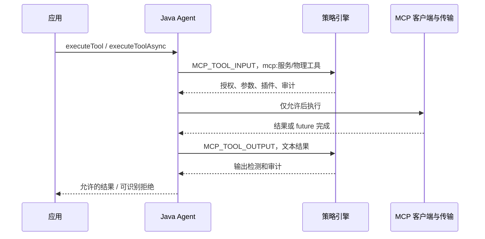

# MCP 工具安全边界

本轮保护 LangChain4j `McpClient.executeTool(...)` 与 `executeToolAsync(...)` 的工具调用。即使应用直接调用 MCP 客户端，没有经过 AiServices 的 ToolExecutor，也会进行输入和输出检测。无需 Spring。

## 1. 先明确支持范围

固定组合为 LangChain4j core `1.20.0`、MCP `1.20.0-beta30`。入口增强同时匹配 McpClient 接口及其实现类，验收使用官方 DefaultMcpClient；自定义实现、不同版本、隐藏类、其他 ClassLoader 场景需要独立验收。客户端所在 ClassLoader 必须能读取这两个库的 pom.properties；版本不匹配拒绝调用。

本轮只支持工具边界，不保护 listTools、instructions、资源读取、提示词、订阅、初始化、子进程启动和任意直接传输调用。构造 DefaultMcpClient 可能已经连接网络或启动进程，所以“拒绝时零工具请求”不表示“零网络访问”。

客户端内部监听器、日志、结果转换器在返回检查前可能看到原始响应；这些组件必须来自可信宿主。异常携带的响应内容没有单独输出净化。不要将异常消息、监听器参数直接交给模型。SDK 不是同 JVM 恶意代码沙箱。

## 2. 配置并启动

由宿主固定客户端 key，不能让模型、工具参数或未经认证的请求选择：

```java
McpClient client = DefaultMcpClient.builder()
        .key("inventory")
        .transport(trustedTransport)
        .build();
```

配置文件：

```properties
# 必须显式列出。缺省或空值表示全部拒绝。
allow.mcp.tools=mcp:inventory/lookup,mcp:ticketing/create
# 同时检查输入参数字符串与输出正文。
deny.text=secret-marker
max.text.chars=100000
```

启动：

```sh
java -javaagent:/opt/security/agent-security-javaagent.jar=/opt/security/policy.properties \
  -jar application.jar
```

服务 key 和物理工具名只接受 1～100 个英文字母、数字、下划线、点、连字符。`/`、冒号、通配符不接受，以保持授权名无歧义。配置错误阻止启动；运行时名称错误拒绝调用。

`key` 是宿主维护的逻辑服务标识，不是服务器密码学身份证明。宿主需要保证每个 key 唯一绑定一个受信任的 endpoint/进程与凭据，不要给不同服务复用 key。TLS、OAuth、API Key、SSRF 和进程权限由宿主传输配置负责，本轮没有替代它们。

## 3. 检测顺序与规则扩展



事件 operation 示例是 `mcp:inventory/lookup`，输入 text 是原始 JSON 参数，输出 text 是 `ToolExecutionResult.resultText()`。SPI Detector 可按 `MCP_TOOL_INPUT` / `MCP_TOOL_OUTPUT` 扩展租户、数据外传、远程检测等规则。原有 [SDK 扩展](sdk-extension.md)、[远程检测](remote-detector.md)、[版本发布](policy-versioning.md) 机制可复用；远程检测配置的 phases 必须显式加入新增阶段。

输入拒绝：同步方法抛 SecurityBlockedException；异步方法返回 failed CompletableFuture，原始工具方法不会执行。异步结果检查恢复入口 SecurityContext，检查后才完成交给应用的 future。取消 guarded future 会尝试取消源 future，不保证撤销已开始的远程副作用。

输出拒绝发生在工具已经执行之后，不是事务回滚。同步重载互相调用时可能出现多次检查和审计；不能把事件数量当作远程执行次数。

### 结构化参数与权限

`tool.policy.path` 指向的现有 ToolPolicy JSON 同样接受 MCP 完整授权名作为 tools 键，例如：

```json
{
  "schemaVersion": 1,
  "tools": {
    "mcp:inventory/lookup": {
      "type": "object",
      "required": ["itemId"],
      "properties": {
        "itemId": {"type": "string", "enum": ["item-1", "item-2"]}
      }
    }
  }
}
```

同时保留 `allow.mcp.tools=mcp:inventory/lookup`。ToolPolicy 对缺失工具规则拒绝；如果 AiServices 同时产生普通 TOOL_INPUT，也要为普通/映射工具名配置对应规则。结构化参数、权限声明与上下文绑定语法见 [工具策略](tool-policy.md)。仅配置 deny.text 是字面匹配，不能代替 JSON 解码校验或语义安全模型。

### 多 Agent 委托

在 AgentGrant.tools 中放入 `mcp:inventory/lookup`。单独授予 `lookup` 不能调用此 MCP 工具；授予 `mcp:other/lookup` 也不能调用。子 Agent 仍继承父子授权交集；过期、撤销和根结束规则作用于新增 MCP 阶段。通过 ToolExecutor 调用时，还需要其普通工具名授权。

服务 key 不是 Agent 身份。根 SecurityContext 必须由宿主认证后建立，父子归属仍通过 AgentRuntime 的显式委托建立，见 [多 Agent 安全](multi-agent-security.md)。

## 4. 输出格式与拒绝原因

当前只检测客户端转换后的文本（包括转换为文本的结构化结果）。`attributes()` 必须是空 Map；任何非空元数据直接拒绝，避免 `_meta` 隐藏内容未经检查流出。没有覆盖原始二进制、图像或被转换器丢弃的内容。下一步可增加有大小、深度、类型限制的元数据检测。

| ruleId | 含义 |
| --- | --- |
| mcp-tool-not-allowed | 服务与工具组合不在本地允许列表 |
| invalid-mcp-name | 客户端 key 或工具名格式无效 |
| unsupported-mcp-version | 缺少 MCP 版本元数据或版本不匹配 |
| mcp-result-attributes-unsupported | 输出带非空或不支持的 attributes |
| agent-tool-denied | 当前委托 Agent 没有此完整工具授权 |
| denied-text / text-limit | 内容规则拒绝 |

适配形状、版本、元数据异常发生在策略引擎之外，当前不会生成完整的策略拒绝审计事件。正常进入引擎的 MCP 输入/输出遵循原有 mandatory audit、检测超时拒绝、可观测性规则。审计默认不记录服务名、工具参数或正文。

## 5. 如何验收

执行完整发布命令 `bash scripts/release.sh`（先正确设置 JAVA_HOME）。`demo/.../McpAgentIT` 为每个场景启动真正携带打包 Java Agent 的独立 JVM，使用官方 DefaultMcpClient 和计数型内存 McpTransport：

- 同步与异步允许：工具传输调用为 1。
- 未配置允许列表、其他服务同名工具、禁止工具、输入命中、无有效委托授权：工具传输调用为 0。
- 同步与跨线程异步恶意返回：工具已经调用 1 次，应用收到拒绝。
- 非法名称、错误 MCP 版本元数据零调用；带隐藏元数据结果拒绝。
- 委托 Agent 在异步返回前结束：恢复原身份并拒绝交付。

这是客户端边界验收，不是实际 HTTP/SSE/stdio、MCP 服务器认证、协议重试、恶意服务器压力测试或生产环境证明。

签名核对来自 [官方 MCP 1.20.0-beta30 源码包](https://repo.maven.apache.org/maven2/dev/langchain4j/langchain4j-mcp/1.20.0-beta30/langchain4j-mcp-1.20.0-beta30-sources.jar)，不可直接用 main 分支 API 推断当前版本。

## 6. 升级注意事项

新增两个 Phase 枚举值；下游枚举穷举 switch、审计解析器及阶段允许列表需要同步升级。指标会增加这两个固定阶段，不会按动态服务名创建标签。旧配置不含 allow.mcp.tools 时，原先未受独立保护的直接 MCP 工具调用现在会被拒绝，部署前必须盘点实际需要的授权。
