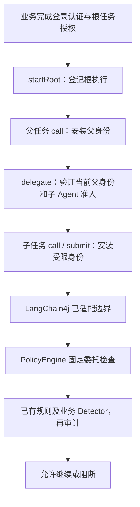

# 多 Agent：同 JVM 的可信委托与权限收窄

当前已提供显式 `AgentRuntime` 调度入口。由可信业务代码登记根任务、创建子任务，再在其作用域内调用 LangChain4j。现有 Agent 在模型、工具、检索和记忆检查中使用这份委托身份。

**本实现不自动从任意父子 Agent 对象推断关系，不验证用户登录凭证，也不提供跨服务 Token 认证。** 主机应用及其调度代码属于信任边界；不是防御同 JVM 恶意代码的沙箱。

## 1. 调用关系与身份



每次执行对应一个不能通过公开构造器创建的 `AgentInvocation` 句柄。`SecurityContext` 新增可空 `invocation()`：

| 值 | 含义 |
| --- | --- |
| `context.runId()` / `invocation.rootRunId()` | 同一棵执行树共享的随机根任务 ID；每次 startRoot 重新生成 |
| `invocation.agentId()` | 可信宿主注册的 Agent 标签，可被多个调用复用 |
| `invocation.invocationId()` | 本次执行唯一 ID |
| `invocation.parentInvocationId()` | 直接父执行 ID；根为 null |
| `invocation.delegationId()` | 此次登记的委托关联 ID，包括根登记 |
| `context.tenantId()/principalId()` | 原始业务认证身份，子任务不能改变 |
| `context.permissions()` | 经过逐级收窄后的权限集合 |

调度器通过自己的有界登记表与句柄对象校验关系，而不是仅相信调用方填写的 UUID。附加了真实句柄但擅自改变 tenantId、principalId、runId 或 permissions 的上下文会被拒绝。

## 2. 最小接入示例

业务项目依赖与 Agent 同一构建的 `agent-security-core`。以下方法可直接放进业务服务；`authenticatedUser` 和 `authorizedRootGrant` 必须来自可信认证／授权代码，`lookupOrder` 是宿主明确绑定的业务操作，例如内部调用 LangChain4j AI Service。

```java
import io.agentsecurity.core.SecurityContext;
import io.agentsecurity.core.delegation.AgentDefinition;
import io.agentsecurity.core.delegation.AgentGrant;
import io.agentsecurity.core.delegation.AgentRuntime;
import io.agentsecurity.core.delegation.AgentRuntimeLimits;
import java.time.Duration;
import java.util.List;
import java.util.Set;
import java.util.concurrent.Callable;

public final class OrderAgentService {
    public static String run(SecurityContext authenticatedUser,
                             AgentGrant authorizedRootGrant,
                             Callable<String> lookupOrder) throws Exception {
        var planner = AgentGrant.tools(Set.of("order:read", "order:delete"),
                Set.of("lookupOrder", "deleteOrder"));
        var reader = AgentGrant.tools(Set.of("order:read"), Set.of("lookupOrder"));
        try (var runtime = new AgentRuntime(
                List.of(new AgentDefinition("planner", planner, Set.of("reader")),
                        new AgentDefinition("reader", reader, Set.of())),
                AgentRuntimeLimits.defaults(),
                (event, decision) -> {
                    // 示例审计；部署时应接入可靠日志或单独的 FileAuditSink。
                    System.err.println(event.phase() + " " + event.context().invocation());
                    if (System.err.checkError()) {
                        throw new IllegalStateException("Lifecycle audit failed");
                    }
                });
             var root = runtime.startRoot("planner", authenticatedUser,
                     authorizedRootGrant, Duration.ofMinutes(1))) {
            return root.call(() -> {
                try (var child = runtime.delegate("reader", planner, Duration.ofSeconds(30))) {
                    // 即使申请 planner 的全部权限，实际也只能获得 reader 的允许范围。
                    return child.call(lookupOrder);
                }
            });
        }
    }
}
```

示例用一次性 runtime 便于看清生命周期；服务应用通常在启动时建立共享 runtime，关闭应用时调用 `close()`。不要把注册表、根任务授权入口或任意 Callable 的选择交给模型。`AgentDefinition` 是能力配置，不自动实例化或验证某个 Agent 实现类；宿主负责把注册标签与实际任务代码绑定。

默认应用继续兼容普通上下文。若你的受保护应用入口全部要求委托身份，在 Agent properties 设置：

```properties
agent.context.required=true
```

这样，遗漏子任务作用域、仅提供普通用户身份或完全没有身份时，会拒绝为 `missing-agent-context`。该设置作用于进入策略引擎的事件，不能保护绕过已适配框架边界的代码。

## 3. 授权怎么计算

根任务有效 grant：业务入口已经授权的范围，与 Agent 定义的能力上限取交集；其中 permissions 还要与 authenticatedUser.permissions 取交集。SDK 不会替业务入口核实用户是否真正有权访问 authorizedRootGrant 中的工具、检索器或资源。

子任务有效 grant：**父任务 grant ∩ 子 Agent 能力上限 ∩ 本次申请 grant**。父定义的 `allowedChildren` 还必须包含目标 agentId，且不得超过最大委托深度。reader 的 allowedChildren 为空就不能继续转授。

`AgentGrant` 各字段都是精确允许列表，空集合表示不允许该类操作，不支持通配符：

| 字段 | 检查位置 | 说明 |
| --- | --- | --- |
| `permissions` | 子任务身份快照 | 供已有工具 JSON 策略、memory 权限配置或自定义 Detector 判断 |
| `tools` | TOOL_INPUT、TOOL_OUTPUT | 精确匹配暴露给框架的工具名 |
| `retrievers` | RETRIEVAL_INPUT、RETRIEVAL_OUTPUT | 精确匹配当前适配器的检索组件标签 |
| `memoryResources` | Memory 读前、读后、写入、删除 | 精确匹配 `ResourceRef(type, id)` |

权限字符串不是自动绑定操作的规则：例如有 `order:read` 并不自动定义所有读工具，有 memoryResources 也不自动区分读写权限。继续通过工具 JSON 的 permissions、`memory.read.permission`／write／delete 或业务 Detector 定义权限含义。

金额上限、订单 ID 归属、逐文档 ACL 和组织动态策略仍由业务授权或 Detector 执行；此版没有通用金额约束、结构化工具资源 grant 或独立组织授权服务。RAG 的实现类标签也不能区分同一类背后的不同数据源。

## 4. 异步子任务与父任务寿命

```java
// 方法体片段：在 root.call 的作用域内，runtime、readerGrant 和应用执行器已存在。
var first = runtime.delegate("reader", readerGrant, Duration.ofSeconds(30));
var second = runtime.delegate("reader", readerGrant, Duration.ofSeconds(30));
var a = first.submit(applicationExecutor, () -> assistant.chat("查询订单 A"));
var b = second.submit(applicationExecutor, () -> assistant.chat("查询订单 B"));
return a.get() + b.get();
```

`call`、`submit` 都只能启动一次。它们安装该执行的上下文，任务结束恢复工作线程原身份，并关闭登记。`submit` 在工作线程真正执行前再次检查，排队期间取消、撤销或过期时不会进入任务体；执行器拒绝也会撤销登记。

父任务必须等后代完成后再返回。父任务 `call` 返回／抛错、主动 `close()` 或 `revoke()` 会使整个子树失效。**不要从 call 中直接返回一个尚未完成的 future 或 Publisher 并结束父任务**；应等待实际操作与受保护结果处理完成。`submit` 的 Callable 也应返回最终结果，而不是另一个尚未完成的异步容器。

取消返回 future 会撤销本次子树，但不保证中断已开始的任务或外部 I/O。对于框架自己发起的异步操作，现有上下文传播携带完整 SecurityContext（包括句柄），后续检查仍会验证是否有效；未适配的业务异步边界仍需显式传播。

## 5. 撤销、过期、资源与失败

- `revoke()` 撤销本次执行及后代；兄弟任务和其他根任务不受影响。
- `close()` 表示本次执行结束，并同样使未结束的后代失效。
- 每次检查验证所有祖先，子任务有效期不超过父任务；使用单调时钟避免墙钟调整导致延长。
- 默认最多登记 256 次执行，根深度为 0，允许深度最多为 8，最长有效期 5 分钟；可通过 AgentRuntimeLimits 收紧或在构造器允许范围内调整。
- 已结束登记立即释放；过期登记在下次注册时惰性清理，过期后的操作检查仍立即拒绝。
- 引擎在检测器执行前与全部通过后各检查一次委托状态，防止慢检测器期间已撤销仍直接放行。
- 检查与业务副作用不是数据库原子事务；撤销不能回滚已完成操作，也不能消除检查通过后与真实 I/O 之间的竞态。实际业务服务仍须执行最终授权。

生命周期审计使用内部 BoundedAuditSink，1 秒预算、128 个排队名额。审计异常使 runtime 进入持续拒绝状态；结束／撤销先使子树失效再写审计，不能因审计失败恢复授权。审计消费者不要重入 runtime，以免锁等待导致超时。runtime 关闭时负责关闭内部审计包装器；若消费者实现 AutoCloseable，也会由包装器在写线程结束后关闭，勿与其他组件混用生命周期不明确的 sink。

## 6. 审计与迁移

FileAuditSink 的 JSONL **schemaVersion 升级为 3**，保留原 runId，并新增：`agentId`、`invocationId`、`parentInvocationId`、`delegationId`。普通上下文这些新字段为 null。关联 ID 由调度器随机产生；agentId 只使用可信注册标签，不填写客户信息或任务正文。

任务登记与生命周期新增 `AGENT_START`、`AGENT_DELEGATE`、`AGENT_FINISH`、`AGENT_REVOKE` 阶段，由 runtime 的审计消费者接收。执行结束／撤销记录表示对应子树失效，不为每个后代重复生成终止事件。过期可从有效期策略与拒绝原因判断，没有后台到期事件流。注册前的参数／准入拒绝目前通过异常返回，不保证每一次失败申请都有生命周期审计记录。

Agent 原有决策审计与 runtime 生命周期审计是两条可关联的流。建议使用不同日志文件，按 runId、invocationId 关联；不要用两个 FileAuditSink 同时写同一路径。Agent stderr 日志也增加 invocation 和 parent；完整结构化字段使用 JSONL。

迁移注意：

1. 用户四参数 SecurityContext 构造方法保留，普通 authenticated 工厂保持原行为。
2. record 组件新增 invocation，反射、序列化、模式匹配与二进制兼容性不能假设不变。Agent、SDK 与插件应统一重新构建部署。
3. 更新审计消费者，兼容历史 schema 1／2 与当前 schema 3，以及新增生命周期 phase。
4. 此句柄只在当前 JVM 有效，不要把 SecurityContext 序列化后当跨服务凭据。
5. SDK 不防御主动删除 invocation、伪造普通身份或绕过 runtime 的恶意宿主代码；专用应用启用 agent.context.required 可以发现普通的传播遗漏，但不能代替进程隔离和外部授权服务。

## 7. 常见拒绝原因

| ruleId | 含义 |
| --- | --- |
| `missing-agent-context` | 已开启必须委托模式，但事件缺少句柄 |
| `agent-parent-required` | 不在父执行作用域中创建子任务 |
| `agent-context-mismatch` | 句柄属于其他 runtime，或用户／权限／runId 与登记不符 |
| `agent-child-denied` | 父定义没有准入该子 Agent |
| `agent-root-from-child` | 在委托身份下尝试直接新建根任务 |
| `agent-unknown` | 未注册的 Agent 标签 |
| `agent-tool-denied` / `agent-retriever-denied` / `agent-memory-denied` | 操作不在有效 grant 范围 |
| `agent-invocation-inactive` / `agent-invocation-expired` | 本次执行或祖先已结束／撤销／过期 |
| `agent-invocation-reused` | 已启动的句柄再次启动 |
| `agent-depth-limit` / `agent-capacity` | 深度或活跃登记数超限 |
| `agent-runtime-closed` / `agent-audit-error` | 调度器关闭或生命周期审计故障 |

## 8. 代码与验证入口

- 核心实现：`agent-security-core/src/main/java/io/agentsecurity/core/delegation/`。
- 固定委托检查：`PolicyEngine.check`，无需注册可被漏装的 Detector SPI。
- 生命周期与边界单元测试：`AgentRuntimeTest`。
- 真实 LangChain4j 工具验证：`DelegationFixture` 与 `DelegationIT`，包含合法、越权、伪造、撤销、缺少上下文、异步兄弟任务。
- 完整回归：仓库根目录 `bash scripts/verify.sh`；发布重建：`bash scripts/release.sh`。

跨服务工作负载认证、短期委托 Token、持久化委托注册表、自动父子框架入口适配、动态组织授权与跨进程撤销均未包含在本版本。
