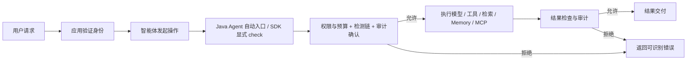

# SDK 使用手册：从了解能力到接入项目

本文是新用户的统一入口。先看功能表和接入选择，再运行一个拒绝示例；需要某项能力时，按对应步骤接入，详细规则查专题文档。无需先阅读源码。

本文对应仓库 `0.1.0-SNAPSHOT` 当前实现：Java Agent 固定适配 **LangChain4j core 1.20.0、MCP 1.20.0-beta30**。源码按 Java 17 编译，最近完整发布验证运行于 macOS arm64 / JDK 21.0.4；634 项测试通过不等于所有平台、外部服务或生产场景均已验收。SDK、Agent、插件应来自同一构建，不能只凭相同 SNAPSHOT 版本号混用。

## 1. 它解决什么问题

假设你的智能体收到用户请求后，会调用模型、查询知识库、执行工具、读写历史会话，甚至调度多个子 Agent。本项目在已经接入的边界上回答三个问题：

- **执行前能不能做？** 检查工具名称、参数、可信权限、资源范围和任务预算；拒绝时不进入该受保护操作。
- **执行后的结果能不能继续传递？** 检查模型输出、工具返回、检索结果和历史消息；拒绝时不把该结果继续交付给受保护的下游。
- **为什么拒绝、哪个任务触发？** 通过审计、固定维度指标和父子执行 UUID 定位决策及故障。

它提供拦截与检测框架、确定性规则和扩展接口。内置文本检测是字面匹配，**没有自带通用语义提示注入模型**。需要语义检测时，接入自己的 Detector 或远程安全服务。



输入授权适合阻止副作用；输出检测适合阻止结果传播。工具已发邮件或转账后，输出拒绝不能回滚副作用。

## 2. 功能一览：能干什么，怎样开启

| 能力 | 可以做什么 | 你要怎么做 | 主要边界 |
| --- | --- | --- | --- |
| 模型输入／输出 | 检查发送给模型的文本、返回正文及已适配消息 | 加载 Agent，配置文本规则或 Detector | 固定模型接口；未提供图像／音频安全检测 |
| 工具准入 | 只允许指定工具，禁止高风险操作 | `allow.tools`／`deny.tools` | 保护 LangChain4j 调度及匹配执行器；直接调用普通业务方法不覆盖 |
| 工具参数 | 校验必填、类型、枚举、范围、长度、未知字段 | `tool.policy.path` 指向工具 JSON | 当前支持规则子集，不是完整 JSON Schema 引擎 |
| 用户／租户权限 | 工具要求权限，参数绑定可信租户／用户 | 应用安装 SecurityContext，JSON 配置 permissions／equalsContext | SDK 不验证 JWT、session 或真实数据归属 |
| 异步与流式 | future 结果检查、已适配身份传播、完整流输出检查 | Agent 自动适配；自建异步用 context 包装 | 流式全量缓冲后释放，会增加首字延迟 |
| RAG | 检索前授权，检索和增强结果正文／元数据检查 | 检索白名单、Detector、数量限制 | 数据库／向量库 ACL 仍由数据源执行 |
| ChatMemory | 历史读前／读后、写入、删除检查 | memory 权限配置；逐会话 ACL 插件 | 不代替存储隔离或数据库事务 |
| MCP | 工具、资源、提示词、目录发现精确授权 | 各自 allow.mcp.* 列表 | 固定客户端 API，订阅及任意直接传输调用不覆盖 |
| MCP 传输治理 | 限制响应与分页，固定 HTTP 目标／凭据，连接故障后持续拒绝 | Agent 配置；宿主提供 HTTPS 和认证头 | 不实现 OAuth、token 验证／刷新或 stdio 沙箱 |
| 多 Agent | 明确父子归属，权限取交集、撤销、过期 | 宿主用 AgentRuntime 创建根与 delegate | 同 JVM 显式委托，不自动推断任意框架调用关系 |
| 共享预算／取消 | 父子共享累计登记、入口检查额度；取消后拒绝结果 | startRoot 指定 AgentBudgetLimits，调用 cancel | 不是 token／费用预算，不保证立即停止 I/O |
| 项目专属检测 | 业务授权、敏感内容检测、内部安全服务接入 | 实现 Detector；Agent 通过 Java SPI 加载 | 允许／拒绝接口，不提供参数改写或审批挂起 |
| 策略发布／回滚 | 编译完整快照，进程内原子切换、回滚、固定任务版本 | PolicyCompiler + AtomicPolicy；Agent 用 VersionedDetector SPI | 不监听文件，不自带管理 API 或跨节点一致发布 |
| 审计 | 记录脱敏决策、规则和父子关联；写失败拒绝 | Agent 配 audit.path；SDK 传审计 sink | 决策日志不表示业务成功，不提供防篡改存储 |
| 可观测性／诊断 | 指标、关联记录、故障分类、执行池健康、插桩通知 | 开启收集，由宿主拉取；可选 Prometheus／OTLP 导出 | 不自动提供管理端口，不保证所有方法都被保护 |

## 3. 先选择接入方式

| 你的情况 | 推荐方式 | 业务代码需要做什么 |
| --- | --- | --- |
| 已有 LangChain4j 项目，先约束工具和文本 | **Java Agent + 配置** | 修改 JVM 启动参数，准备策略文件；基础拦截不必引入 core 依赖 |
| 已有项目，还要用户权限、业务专属策略 | **Java Agent + core + 策略插件** | 认证入口安装上下文；实现并注册 Detector |
| 要保护自定义业务边界，或者不使用 Agent | **独立 SDK** | 创建 PolicyEngine，操作前／结果交付前显式 check |
| 有父子 Agent 权限、预算、取消要求 | **AgentRuntime + 上述任一种检查方式** | 可信宿主显式创建、执行和等待根／子任务 |

**普通 Java 与 Spring Boot 都可以使用。** core 没有第三方运行时依赖，也不依赖 Spring；Boot 模块是集成验收应用。当前没有 Spring Boot Starter 自动配置模块，不需要给 Detector 加 Spring 注解。Agent 的插件发现使用 Java SPI。

独立 SDK 不会因“引入依赖”自动拦截 LangChain4j。自动拦截由 JVM 启动时加载的 `-javaagent` 实现；手动构造的引擎也不会自动替换 Agent 内部引擎。

### 模块选择

| 制品 | 使用场景 |
| --- | --- |
| `io.github.umuo:agent-security-core` | 事件、引擎、上下文、Detector、委托、预算、审计和基础收集 |
| `io.github.umuo:agent-security-policy` | 严格工具参数策略、远程 HTTP Detector、策略编译；依赖 core |
| `io.github.umuo:agent-security-telemetry` | Prometheus 文本及 OTLP/HTTP 日志导出；可选 |
| `agent-security-javaagent.jar` | JVM 启动加载的自动拦截制品，独立放到部署目录 |

Maven 坐标已迁移为 io.github.umuo，Java 包名不变。本手册不假设制品已发布到 Maven Central；当前 SNAPSHOT 可先从源码构建、安装到本地仓库。公开制品发布与 release 版本引用见 [Central 发布手册](maven-central-publishing.md)。

## 4. 十分钟跑通：先观察实际阻断

准备 JDK 和 Maven 3.6.3+，在仓库根目录执行：

```bash
# 构建代码与演示制品，首次需要访问 Maven 仓库。
# 本命令只为快速演示跳过测试；部署验收请用后文的 release 流程。
mvn -B -ntp -s .mvn/settings.xml -Dmaven.repo.local=.cache/m2 -DskipTests package

# 对照：没有 Agent，邮件工具执行一次。
java -jar demo/target/agent-security-demo.jar tool

# 有 Agent：邮件工具被阻断，执行次数为零。
bash scripts/demo.sh tool

# 有 Agent：合法查询放行。
bash scripts/demo.sh allowed
```

预期：

```text
RESULT scenario=tool blocked=false modelCalls=2 toolCalls=1
RESULT scenario=tool blocked=true modelCalls=1 toolCalls=0
RESULT scenario=allowed blocked=false modelCalls=2 toolCalls=1
```

这些演示使用本机模拟组件，不需要外部模型 API key。验收重点是工具执行次数，而不只是看到“DENY”日志。

继续体验其他能力：

```bash
bash scripts/demo.sh input           # 模型输入拒绝
bash scripts/demo.sh output          # 模型输出拒绝
bash scripts/demo.sh tool-output     # 工具返回拒绝；工具可能已经执行
bash scripts/demo.sh stream-output   # 流式输出拒绝
bash scripts/demo.sh reactive-allowed
bash scripts/demo.sh rag-input       # 检索前拒绝
bash scripts/demo.sh rag-output      # 检索后拒绝，模型不消费结果
bash scripts/demo.sh tool-args-foreign config/tool-demo.properties
bash scripts/demo.sh tool-args-allowed config/tool-demo.properties
```

## 5. 接入你的 LangChain4j 应用

### 5.1 准备 Agent 和基础策略

从构建目录取得 `agent-security-javaagent/target/agent-security-javaagent.jar`，放到固定部署位置。创建 UTF-8 `policy.properties`：

```properties
policy.version=my-app-v1
# 示例工具名称必须改成项目实际暴露的名称。
allow.tools=lookupCustomer,readCustomer
deny.tools=deleteAll,sendEmail
# 演示字面规则，替换成业务要求；不等于语义注入检测。
deny.text=IGNORE_SECURITY_TEST,DEMO_SECRET_123
max.text.chars=100000
```

允许列表中的工具名称区分大小写、精确匹配；显式空的 `allow.tools=` 拒绝全部工具。普通工具如果未配置白名单且未命中其他拒绝规则，默认可放行。MCP 则需要单独显式授权，默认拒绝。

启动你的普通 Java 或 Boot 可执行 JAR：

```bash
java -javaagent:/opt/agent-security/agent-security-javaagent.jar=/opt/agent-security/policy.properties \
  -jar /opt/my-app/application.jar
```

把 `-javaagent` 放在 `-jar` 前。IDE 填入 **VM options**；部署平台放入 Java 进程的 JVM 参数。Agent 必须先于可能加载 LangChain4j 类的其他 Agent，已加载目标类时会拒绝启动。不支持启动后任意 attach 或随意切换 LangChain4j 版本。

基础规则不要求应用新增 SDK 依赖。若需要上下文、插件或读取诊断，再引入同一构建版本 core。不要把多个不同构建的 core／Agent 混在应用 classpath 中。

### 5.2 增加工具参数约束

在主策略里加：

```properties
tool.policy.path=tool-policy.json
```

旁边创建 `tool-policy.json`，下面只允许查指定客户，每次最多 10 条：

```json
{
  "schemaVersion": 1,
  "tools": {
    "lookupCustomer": {
      "type": "object",
      "required": ["customerId", "limit"],
      "additionalProperties": false,
      "properties": {
        "customerId": {"type": "string", "enum": ["demo-customer"], "maxLength": 64},
        "limit": {"type": "integer", "minimum": 1, "maximum": 10}
      }
    }
  }
}
```

路径相对 **properties 所在目录**，不是应用工作目录。启用后 JSON 中未定义的工具也拒绝；若还需要 `readCustomer`，必须给它增加规则。字符串 enum 是演示静态范围，不证明真实客户归属。

真实应用参数要对应实际工具签名。进一步规则、JSON 解码和租户绑定见 [工具策略](tool-policy.md)。主策略与工具 JSON 在启动时加载，编辑文件后默认需重启；动态发布是第 8 节的独立能力。

### 5.3 验收你的应用

先跑一个合法请求，再分别跑禁止工具、非法参数、拒绝输出。核对受保护工具／检索器／存储真实调用次数；输入拒绝应该是零副作用，输出拒绝时上游操作可能已发生。

异步和流式路径也需单独验收，不能只测同步 chat。通过 [运行时诊断](runtime-diagnostics.md) 查看插桩通知、版本与执行池，但 `installed=true` 不证明全部业务路径已经覆盖。

## 6. 独立 SDK：完整最小示例

在本仓库安装 core 到一个明确的本地 Maven 仓库：

```bash
export AGENT_SECURITY_M2="$PWD/.cache/m2"
mvn -B -ntp -s .mvn/settings.xml -Dmaven.repo.local="$AGENT_SECURITY_M2" \
  -pl agent-security-core -am -DskipTests install
```

在业务项目 `pom.xml` 增加：

```xml
<dependency>
  <groupId>io.github.umuo</groupId>
  <artifactId>agent-security-core</artifactId>
  <version>0.1.0-SNAPSHOT</version>
</dependency>
```

业务项目构建同样传入 `-Dmaven.repo.local="$AGENT_SECURITY_M2"`，或使用团队私有 Maven 仓库。完整独立 Maven 项目模板见 [扩展指南](sdk-extension.md)。

保存为 `SdkQuickStart.java`，示例保护一个计数工具，先放行后拒绝：

```java
import io.agentsecurity.core.*;
import java.util.List;
import java.util.concurrent.atomic.AtomicInteger;

public final class SdkQuickStart {
    public static void main(String[] args) {
        var calls = new AtomicInteger();
        Detector detector = event -> {
            if (event.phase() == SecurityEvent.Phase.TOOL_INPUT
                    && "deleteAll".equals(event.operation())) {
                return Decision.deny("destructive-tool");
            }
            return Decision.allow();
        };
        // 演示只打印脱敏字段；实际部署替换为可靠审计 sink。
        try (var engine = new PolicyEngine(List.of(detector), (event, decision) -> {
            System.out.println("AUDIT phase=" + event.phase() + " rule=" + decision.ruleId());
        })) {
            engine.check(new SecurityEvent(SecurityEvent.Phase.TOOL_INPUT, "lookup", "{}"));
            calls.incrementAndGet(); // 检查通过，才执行真实操作。
            try {
                engine.check(new SecurityEvent(SecurityEvent.Phase.TOOL_INPUT, "deleteAll", "{}"));
                calls.incrementAndGet();
                throw new AssertionError("禁止工具被放行");
            } catch (SecurityBlockedException denied) {
                System.out.println("BLOCKED rule=" + denied.ruleId());
            }
            if (calls.get() != 1) {
                throw new AssertionError("副作用计数错误");
            }
            System.out.println("toolCalls=" + calls.get());
        }
    }
}
```

在仓库根目录用构建后的 core JAR 运行，不需要 Spring 或 LangChain4j：

```bash
mkdir -p /tmp/agent-security-quickstart
javac -cp agent-security-core/target/agent-security-core-0.1.0-SNAPSHOT.jar \
  -d /tmp/agent-security-quickstart SdkQuickStart.java
java -cp /tmp/agent-security-quickstart:agent-security-core/target/agent-security-core-0.1.0-SNAPSHOT.jar SdkQuickStart
```

这些 classpath 命令面向 macOS／Linux，Windows 分隔符改为 `;`。预期包含 `BLOCKED rule=destructive-tool` 和 `toolCalls=1`。将副作用替换为真实工具前保留 check；需要输出保护时，在交付结果前另建相应 `*_OUTPUT` 事件并检查。

独立构造 PolicyEngine 时，**Agent properties 不会自动应用到这个引擎**。需要字面规则就加入 `new LocalPolicy(properties)`，需要身份就加入 `new RequiredContextPolicy()`，需要工具 JSON 就加入 policy 模块的 `ToolPolicy.fromPath(path)`。

## 7. 按业务需求逐步加能力

### 7.1 用户／租户授权

认证系统先验证 token、session 和用户权限，再在调用智能体的入口安装快照。以下变量必须来自可信业务代码：

```java
var context = SecurityContext.authenticated(
        verifiedTenantId, verifiedUserId, verifiedPermissions);
try (var scope = SecurityContexts.open(context)) {
    return assistant.chat(userMessage);
}
```

在 Agent 配置中启用 `context.required=true`；工具 JSON 使用 `permissions` 和 `equalsContext`。这可以限制“有权限才能调用”“tenantId 参数必须等于可信租户”，真实订单／客户归属仍需 ACL 插件和服务端授权。

自建线程池不是自动传播范围；使用 `SecurityContexts.executor(executor)` 或 `wrap`。完整示例见 [身份与异步传播](security-context.md)。

### 7.2 项目专属策略插件

例如退款必须有 `order:refund`，或内容要经过企业风控：

1. 创建独立项目，依赖同一构建的 core，按需加 policy。
2. 实现 public、线程安全、无参构造的 `Detector`，按 `event.phase()` 判断自己负责的边界。
3. 返回固定 `Decision.deny("order-refund-forbidden")` 或 `allow()`，不把正文／异常消息放到 ruleId 中。
4. 注册文件 `src/main/resources/META-INF/services/io.agentsecurity.core.Detector`，逐行填写实现类全名。
5. 把插件及其依赖加入 **应用 classpath／Boot 依赖**，使用 `-javaagent` 启动并验证实际阻断。

Agent 在受保护请求使用应用 ClassLoader 延迟加载 SPI，插件放在 Agent JAR 旁边并不会自动被发现。Spring `@Component` 不代替 SPI。独立 SDK 则直接将 Detector 实例放入引擎列表，不需要 SPI。

可复制的插件项目、自检、普通 Java／Boot 部署方式见 [扩展指南](sdk-extension.md)。调用外部风控可用 [RemoteHttpDetector](remote-detector.md)，宿主必须提供内容最小化、可信 endpoint、凭据和连接资源配置；客户端自身不提供语义模型。

### 7.3 RAG 与 Memory

RAG：配置 `allow.retrievers` 限制检索实现，使用 Detector 做查询和结果检测，设置 `rag.max.contents`／`rag.max.metadata.entries` 控制处理量。数据源仍要执行租户 ACL，输出拒绝不撤销已完成的数据读取。见 [RAG 手册](rag-security.md)。

Memory：按需配置 `memory.read.permission`、`memory.write.permission`、`memory.delete.permission`，用 Detector 将 `event.resource()` 与可信用户／租户交给会话 ACL 查询，设置 `memory.max.messages`。窗口记忆写入可能同时读取旧消息，默认 set 可能触发删除，验收时检查组合权限。见 [Memory 手册](memory-security.md)。

### 7.4 MCP

宿主固定 DefaultMcpClient 的 `.key("inventory")`，并唯一绑定受信任服务；key 是逻辑标识，不是服务器认证证明。以下配置分别授权工具和目录：

```properties
allow.mcp.tools=mcp:inventory/lookup
allow.mcp.discovery=mcp-discovery:inventory/listTools
mcp.http.require.bearer=true
```

工具授权不自动开放目录、资源和提示词。资源授权用 `McpOperations.resource(server, rawUri)` 生成，提示词用 `McpOperations.prompt(server, name)`，目录用 `McpOperations.discovery(server, method)`；写到各自的 `allow.mcp.resources`、`allow.mcp.prompts`、`allow.mcp.discovery`。

HTTP 凭据由宿主提供，远程地址使用 HTTPS、关闭重定向；凭据变更和认证／连接失败后，关闭旧客户端并显式重建。Agent 不刷新 token；stdio 子进程的启动权限由宿主限制。

按顺序阅读 [工具](mcp-security.md) → [资源／提示词](mcp-content-security.md) → [发现与容量](mcp-discovery-limits.md) → [分页](mcp-pagination-metrics.md) → [HTTP 认证](mcp-http-auth-security.md)。

### 7.5 多 Agent、共享预算与取消

宿主使用 `AgentDefinition` 定义可派生的子类型和权限上限；父任务通过 `delegate` 签发子句柄，子身份不能自行填父 ID。下面是无 Spring 的完整树示例，保存在 `AgentTreeQuickStart.java`：

```java
import io.agentsecurity.core.*;
import io.agentsecurity.core.delegation.*;
import java.time.Duration;
import java.util.List;
import java.util.Set;

public final class AgentTreeQuickStart {
    public static void main(String[] args) throws Exception {
        var grant = AgentGrant.tools(Set.of("read"), Set.of("lookup"));
        var definitions = List.of(
                new AgentDefinition("planner", grant, Set.of("reader")),
                new AgentDefinition("reader", grant, Set.of()));
        // 演示 sink；生产应接入可靠审计，避免序列化事件正文。
        try (var runtime = new AgentRuntime(definitions, AgentRuntimeLimits.defaults(), (e, d) -> {});
             var engine = new PolicyEngine(List.of(), (e, d) -> {})) {
            var identity = SecurityContext.authenticated("tenant-a", "user-a", Set.of("read"));
            try (var root = runtime.startRoot("planner", identity, grant,
                    Duration.ofMinutes(1), new AgentBudgetLimits(20, 100))) {
                root.call(() -> {
                    try (var child = runtime.delegate("reader", grant, Duration.ofSeconds(30))) {
                        return child.call(() -> {
                            engine.check(new SecurityEvent(SecurityEvent.Phase.TOOL_INPUT, "lookup", "{}"));
                            System.out.println("parentLinked=" + root.invocationId().equals(child.parentInvocationId()));
                            return "safe result";
                        });
                    }
                });
                System.out.println("invocations=" + root.budgetSnapshot().invocations());
                System.out.println("protectedChecks=" + root.budgetSnapshot().protectedChecks());
            }
        }
    }
}
```

按第 6 节的 javac／java 命令替换类名运行，预期 `parentLinked=true`、`invocations=2`、`protectedChecks=1`。20 次累计登记包含根，100 次额度是入口检查尝试数；父子共享，完成不返还。工具真正执行仍由宿主在 check 后完成。

宿主持有句柄调用 `root.cancel()` 可以使整树失效。父任务应等待子任务完成再返回；多线程使用 `child.submit(executor, callable)`。权限是父授权、申请范围和子定义上限的交集，任务期限也不能超过父任务。

取消先完成时，不再交付成功值；它不强杀任务、不中断所有 I/O、不回滚副作用。排队任务的 future 要等执行器处理后才会异常完成。完整授权与任务生命周期见 [多 Agent](multi-agent-security.md)，预算计数和取消竞态见 [共享预算](multi-agent-budget.md)。

## 8. 策略更新：配置重启与原子发布要区分

最简单的 Agent properties／工具 JSON 在启动时读取，修改后重启应用。`policy.version` 是静态审计标识，不是一个策略中心开关。

需要运行中发布时，用 policy 模块的 `PolicyCompiler` 编译候选，core 的 `AtomicPolicy` 维护有限版本目录，`publish(expectedGeneration, candidate)` 原子切换，`rollback(generation, version)` 回滚。Java Agent 通过应用的 `VersionedDetector` SPI 使用共享发布器。

每次 check 使用一个版本快照；想让整个 SDK 任务固定版本，显式使用 `engine.pinPolicy()` 并传给子／异步任务。Agent 不自动按整个 run 固定版本；固定旧版本也不能绕过撤销和期限。配置监听、管理 API、审批、跨实例同步由宿主实现。见 [策略版本与回滚](policy-versioning.md)。

## 9. 常用配置速查

下面是 Java Agent properties 键；独立 SDK 通常通过对应构造器、策略实例设置，不能将整份 Agent 文件直接传给只接收本地规则的 LocalPolicy。

| 配置组 | 常用键 | 初次接入建议 |
| --- | --- | --- |
| 文本／工具 | `allow.tools`、`deny.tools`、`deny.text`、`max.text.chars` | 先显式允许必要工具；文本上限默认 100000 UTF-16 单元 |
| 工具 JSON | `tool.policy.path` | 相对主配置所在目录；只定义必要工具 |
| 身份 | `context.required` | 默认 false；完成可信入口接入后设 true |
| 检索 | `allow.retrievers`、`rag.max.contents`、`rag.max.metadata.entries` | 逐检索器验证，别把组件白名单当数据 ACL |
| Memory | `memory.read.permission`、`memory.write.permission`、`memory.delete.permission`、`memory.max.messages` | 权限键具体为 read／write／delete；验证实际组合调用 |
| MCP 允许列表 | `allow.mcp.tools`、`allow.mcp.resources`、`allow.mcp.prompts`、`allow.mcp.discovery` | 各自缺省或空值均拒绝 |
| MCP 容量 | `mcp.max.response.bytes`、`mcp.pagination.max.pages`、`mcp.pagination.max.items`、`mcp.pagination.max.json.bytes` | 默认响应 1MiB，分页 16 页／128 项／1MiB JSON |
| MCP 时间与认证 | `mcp.pagination.timeout.ms`、`mcp.http.require.bearer` | 默认分页预算 30000ms；Bearer 必填默认 false |
| 流式 | `stream.max.chars`、`stream.max.events`、`stream.max.active`、`stream.timeout.millis` | 默认 100000／2048／64；总期限默认 60000ms |
| 检测执行器 | `detector.timeout.millis`、`detector.max.concurrent` | 默认检测链总预算 500ms、并发 4；插件需自己的可靠超时 |
| 审计 | `audit.path`、`audit.max.bytes`、`audit.backups`、`audit.force`、`audit.timeout.millis`、`audit.queue.capacity` | 每 JVM 独立文件，可信目录；默认等待 1000ms、队列 128 |
| 版本／遥测 | `policy.version`、`telemetry.enabled` | 收集默认 false；开启不自动向外导出 |

配置键必须按表中完整名称填写。未知键、非法值或缺失文件会导致启动失败。完整取值范围查各专题和 [部署配置示例](../config/deployment-example.properties)。

检测、审计、流式和分页预算是不同层的预算，不是统一业务请求的硬返回期限。多个边界分别检查，不响应中断的插件／业务 I/O 可能仍在运行。

## 10. 审计、监控与故障处理

Agent 未配置 audit.path 时用脱敏 stderr 审计；需要文件日志时设置独立路径。独立 SDK 用 `FileAuditSink`，必要时包 `BoundedAuditSink`，传入引擎。审计必须成功才能放行；BoundedAuditSink 失败、超时或饱和后保持拒绝，排查并重建实例，不能用无操作 sink 绕过故障。

审计只记录允许／拒绝决策。内置 JSONL 使用 schema 3，包含事件、run、父子执行 UUID 和版本，不输出正文、参数、凭据或用户／租户标识。SDK 直接传入普通 BiConsumer 不会自动变成有界审计执行器，宿主需要自己选择包装和生命周期。

指标：Agent 开启 `telemetry.enabled=true` 后，从 `SecurityTelemetry.global()` 拉取；SDK 显式传入收集器。可选 telemetry 模块提供 `PrometheusMetrics` 和 `OtlpLogExporter`，由宿主暴露端点或启动导出。队列丢记录不改变安全决策，收集不替代强制审计。见 [可观测性](observability.md)。

故障：捕获 `SecurityBlockedException` 使用 `ruleId()`，已接入边界的错误还能读取可空 `diagnostic()`，按 UUID 关联父子调用。`FailureDiagnostics.global()` 提供独立有界故障队列，不由现有 OTLP 导出器自动消费。见 [故障诊断](failure-diagnostics.md)。

| 症状／ruleId | 优先检查 | 处理 |
| --- | --- | --- |
| 启动配置错误 | 路径、未知键、文件编码、JSON 规则 | 修正配置后重启 |
| `unsupported-langchain4j-version`／`unsupported-mcp-version` | 应用实际依赖及版本元数据 | 对齐固定支持版本，不跳过检查 |
| 工具不执行、`tool-not-allowed` | 工具暴露名和所有策略允许范围 | 修正必要授权，重跑计数验收 |
| `tool-argument-policy`／`permission-denied` | 解码参数、权限和可信租户绑定 | 调整合法请求或授权，不吞拒绝继续执行 |
| `missing-security-context` | 认证作用域和异步传播 | 补齐可信上下文，不采用模型提供的身份 |
| `detector-timeout`／`detector-capacity` | 慢插件、远程服务、执行池 active／queued | 排查阻塞与容量；检测失败继续拒绝 |
| `audit-error`／`agent-audit-error` | 文件权限、磁盘、独占锁、审计超时 | 修复 sink，按生命周期重建；不降级放行 |
| `agent-budget-checks`／`agent-budget-invocations` | 循环调度、重复边界、预算快照 | 分析工作量；可信入口为新任务配置合理预算 |
| `agent-invocation-inactive` | 父任务提前返回、取消、撤销或过期 | 修正任务生命周期与等待关系 |
| MCP HTTP 认证／连接故障 | 服务端、凭据、目标和首个失效原因 | 修复后显式重建传输／客户端 |
| 插件没有生效 | 应用 classpath、SPI 文件、实际 phase | 先自检 SPI，再跑真实拒绝用例 |

future 可能将拒绝包在 CompletionException／ExecutionException 中，流式输出拒绝通常走 onError。按接口统一映射业务错误，切勿捕获后继续工具副作用或把原始服务端异常文本直接回灌给模型。完整恢复说明见 [运行手册](operations.md)。

## 11. 新项目接入完成的标准

1. 固定 SDK／Agent／LangChain4j 构建版本，明确实际使用的边界。
2. 合法请求放行；输入拒绝的实际副作用次数为零；输出拒绝不交付不合规结果。
3. 自定义插件已打包、注册并在真实应用里阻断；身份策略使用可信认证结果。
4. 同步、异步、流式、并发路径和线程复用分别验收。
5. 多 Agent 明确父子关系、最小权限、父等待子；验证预算耗尽、取消和过期。
6. 检测服务／审计故障继续拒绝；部署资源有界，日志和导出不泄露正文及凭据。
7. 在你的实际模型 provider、数据库、MCP 服务及运行平台上完成额外验收。

仓库全量验证：`bash scripts/verify.sh`。需要 SBOM、测试报告、4 个运行时 JAR 隔离重建和校验和：`bash scripts/release.sh`。当前已知缺口与证据见 [生产验收](production-readiness.md)，交付流程见 [发布工程](release-engineering.md)。

## 12. 常见问题与下一步阅读

**只依赖 LangChain4j，没有 Spring，能用吗？** 能。自动模式加载 Agent；需要身份或插件再增加对应 SDK 依赖。

**加 core 依赖就会自动拦截吗？** 不会。自动模式需要启动 Agent，SDK 模式要显式 check。

**能检测所有提示注入吗？** 不能作此保证。内置字面规则用于确定性示例，语义检测与准确率评估另行实现。

**能检查任意文件、SQL、HTTP 或直接调用的业务方法吗？** Agent 不覆盖这些通用系统操作。可以在可信应用边界用 SDK 显式保护，底层系统也要做自身授权。

**能替我认证父子 Agent 或签发跨服务 token 吗？** 当前 runtime 在同 JVM 建立明确委托；业务认证和跨服务协议由宿主实现。

**允许规则能覆盖另一个检测器的拒绝吗？** 不能，检测链任一拒绝即拒绝；插件不能放宽固定委托检查。

**可以修改参数、自动脱敏、转路由或等人工审批吗？** Detector 接口只返回允许／拒绝。这些流程由应用编排实现。

**取消会立即停止工具吗？** 不能保证，只阻止后续受保护操作与取消后的成功结果交付，已发生副作用不回滚。

建议阅读路线：本手册 → [图解原理](architecture-explained.md) → 你的业务专题 → [扩展指南](sdk-extension.md) → [部署运行](operations.md)。需要学习实现时再阅读 [源码学习路线](source-learning.md)。


### 本手册示例验证记录

2026-10-03，在 JDK 21.0.4 上使用同一构建产物，按 Java 17 目标编译两个完整 Java 示例：`SdkQuickStart` 输出 `toolCalls=1`，`AgentTreeQuickStart` 输出 `parentLinked=true`、`invocations=2`、`protectedChecks=1`。工具 JSON 经 SDK 验证 limit=10 放行、limit=11 拒绝。使用本手册基础配置和工具 JSON 启动真实 Agent 演示：allowed／tool-args-allowed 放行，tool／tool-args-foreign 阻断且工具调用数为零。Wiki 严格构建通过。

本次仅修改文档，未重跑整套 634 项发布矩阵；该数量来自最近一次运行时代码发布验收。上述检查证明手册示例与当前 API 对齐，不证明实际业务项目已接入或所有攻击均可检测。
